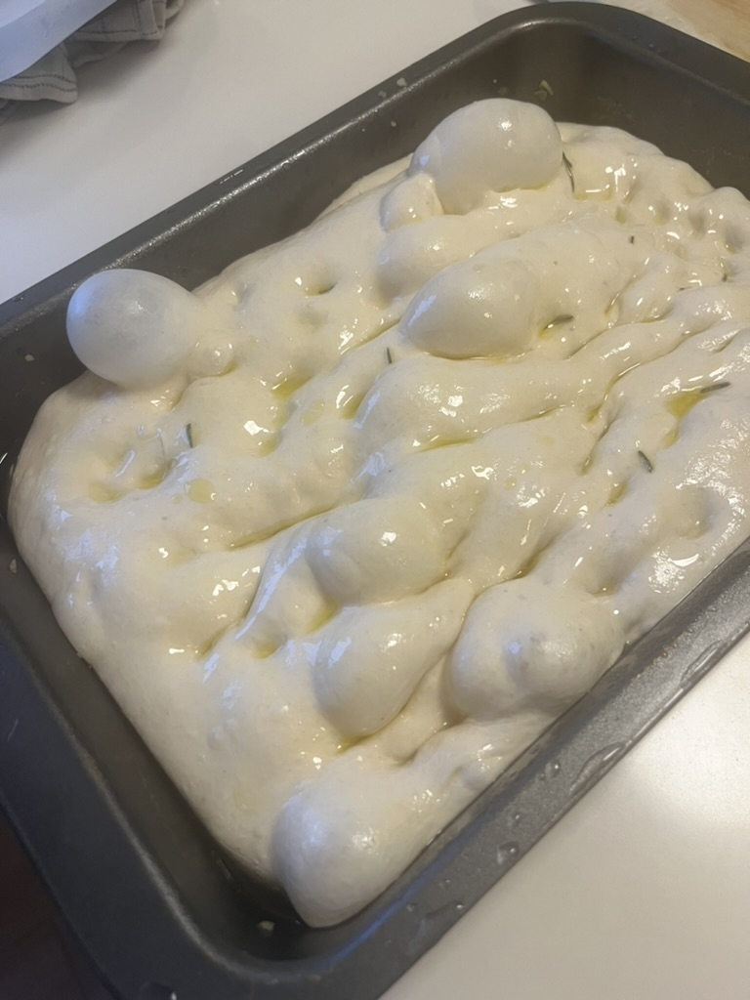
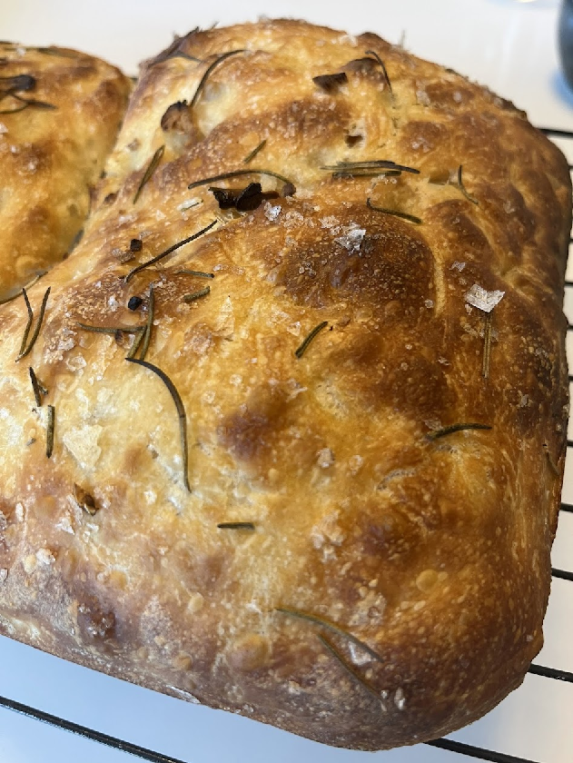
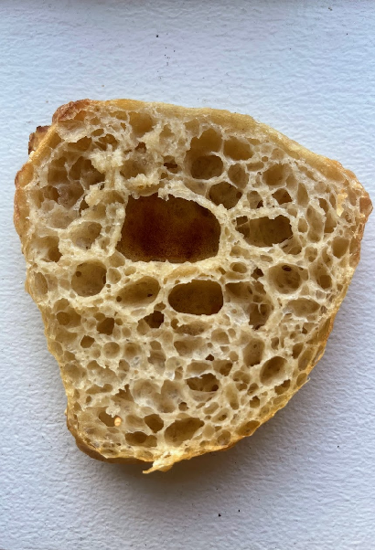

# Weekday Focaccia

Laminated with garlic and rosemary oil. About 30 minutes of hands-on time spread across
two days, arranged so the dough waits for you rather than the other way round.

## Formula

For one tray of roughly 30 × 20 cm (a standard quarter sheet or 9 × 13 in pan).

| Ingredient | Baker's % | Grams |
|---|---|---|
| Bread flour | 90% | 450 g |
| Whole wheat or rye flour | 10% | 50 g |
| Water | 80% | 400 g |
| Salt | 2% | 10 g |
| Cold-fed levain, 100% hydration | 12% | 60 g |

Plus, on the side:

- **Garlic oil.** About 80 ml olive oil, gently warmed with 3 or 4 crushed garlic cloves until
  the garlic just starts to sizzle, then taken off the heat and left to steep for 30 minutes.
  Strain or fish the cloves out.
- **Rosemary oil.** Same method, with a couple of sprigs of rosemary. You can do both in one pan.
- **Flaky salt** and **fresh rosemary** for the top.

You need around 120 ml of oil in total across the lamination, the container, and the top.

Hydration is high on purpose. The cold rest makes an 80% dough easy to handle: at fridge
temperature it feels stronger and less sticky than the same dough would at room temperature.
Levain at 12% is enough. This method needs less than the usual 20% because the dough arrives at
bulk already primed with sugar.

## Schedule

The times below assume a working day. On a weekend, cut either cold rest as short as you like.

| When | What | Hands-on |
|---|---|---|
| Day 0, evening | Wake levain, mix dough, into fridge | 10 min + 1 h wait |
| Day 1, after work | Warm up, stretch, laminate with oil, bulk with coil folds, into oiled container, fridge | 15 min over 4–5 h |
| Day 2, whenever | Out of fridge 2–3 h ahead, dress, dimple, bake | 10 min + 30 min bake |

You can also mix on the morning of Day 1 for a shorter first cold rest. It is fine.

## Day 0, evening: mix

1. Weigh the water into a large bowl. Take a levain from the fridge and dissolve it in the water
   with your fingers. No need to warm it first.
2. Whisk in about 350 g of the flour to make a thick batter of roughly equal flour and water.
   Put the salt on top of the remaining flour so you do not forget it.
3. Leave it for about an hour, or until you see bubbles forming. The yeast is waking up in a
   wet, sugar-rich, low-stress environment.
4. Add the remaining flour and the salt. Mix until there is no dry flour. It will be shaggy and
   wet. Do not knead.
5. Cover and put it in the fridge. It stays there until you get home tomorrow, 8 to 20 hours.
   Amylase is now making sugar. The pH is still high, so the gluten is safe.

## Day 1, after work: laminate and bulk

1. Take the dough out and let it sit for about an hour to lose the chill.
2. Give it one **stretch-and-fold** in the bowl: grab an edge, stretch it up, fold it over.
   Turn the bowl a quarter turn and repeat, four times in total.
3. **Laminate.** Oil the counter lightly with garlic oil. Tip the dough out and gently stretch it
   from the edges into a thin rectangle, as thin as it will go without tearing. Brush or drizzle
   garlic oil and rosemary oil over the surface. Fold one third in, brush that with oil, fold the
   other third over. Fold the resulting strip in thirds again the other way. Return it to the
   bowl, or better, to a wide shallow container.
4. **Bulk** for 3 to 4 hours total at room temperature, with a gentle **coil fold** every 45 to
   60 minutes, 3 folds in all. Slide both hands under the middle of the dough, lift, and let the
   ends tuck under themselves. Do not degas it.
5. When it is puffy and jiggly, transfer it to a flat, wide container generously oiled with
   garlic oil. Let it rest 30 to 60 minutes.
6. Cover and put it in the fridge overnight. This second cold rest relaxes the gluten so the
   dough spreads instead of fighting you, and concentrates sugar at the surface for colour.

If you will not have time to let it warm up tomorrow, ferment an hour longer today instead.

## Day 2, whenever: bake

1. Take the dough out 2 to 3 hours before baking and leave it covered at room temperature to
   rise and get bubbly.
2. Line a tray with baking paper. Pour the dough onto it and let it slump into shape. Baking
   paper beats oiling the tray: less sticking, and you do not need a puddle of oil.
3. Drizzle garlic oil and rosemary oil over the top. Be generous with flaky salt. Scatter fresh
   rosemary; it is far more fragrant than dried.
4. **Pop any large bubbles**, or they will just burn.
5. Press the oil into the dough with oiled fingertips, straight down to the tray, all over.
   Rest another 30 minutes or so while the oven heats.
6. Heat the oven to **230 °C (450 °F)**. Put a small tray on the floor of the oven for steam.
7. **Bake 10 to 15 minutes with steam** on the convection setting: pour a cup of boiling water
   into the steam tray as you load the focaccia.
8. Optional: pull it out and baste with a little more oil. It is much easier to get an even
   coating once the crust has set.
9. **Bake another 10 to 15 minutes without steam**, top and bottom heat, until deeply golden.
   This dough is full of sugar and browns fast. If the top is racing ahead, drop the oven to
   210 °C (410 °F) or tent loosely with foil.
10. Cool on a rack for at least 20 minutes so the base stays crisp.

## Why the steps are where they are

- **Cold rest before bulk.** Amylase is active in the fridge; yeast is not. The dough gets a
  night of sugar production without fermentation, so bulk the next day is quick and the crust
  browns hard. Protease stays quiet because the pH has not dropped yet, so the gluten survives.
- **Lamination with oil.** Stretching the dough thin and folding it with oil between the layers
  gives the layered, tearable interior and gets the garlic flavour through the whole slab, not
  just the top.
- **Coil folds, not kneading.** The dough builds structure passively during the cold rest. The
  folds just organise it without knocking out the gas.
- **Wide, oiled container for the second cold rest.** A shallow vessel equalises temperature
  quickly and lets bubbles spread sideways into the irregular holes you want.
- **Steam, then dry heat.** Steam keeps the surface supple while the focaccia expands. Dry heat
  afterwards drives the Maillard browning that all that residual sugar is waiting for.

## Variations

- **Weekend version.** Mix in the morning, bulk in the afternoon, bake in the evening. Skip the
  second cold rest. It will be a little less blistered on top and just as good.
- **Deep-pan pizza.** Same dough. Stop before the rosemary, top it after dimpling, bake the same way.
- **Rolls.** Divide after bulk, flatten each piece only enough to grab and slap it, fold once,
  rest 15 minutes, bake. A strong dough will still release gas and rise.

## Notes

- The oven temperature above is a working default and not something the original notes
  pinned down. Adjust it to your oven; the steam-then-dry sequence and the two bake windows are
  the parts that matter.
- Salt is on the low side of normal at 2%. Do not go higher: the flaky salt on top carries it,
  and more salt in the dough slows both the enzymes and the yeast.
